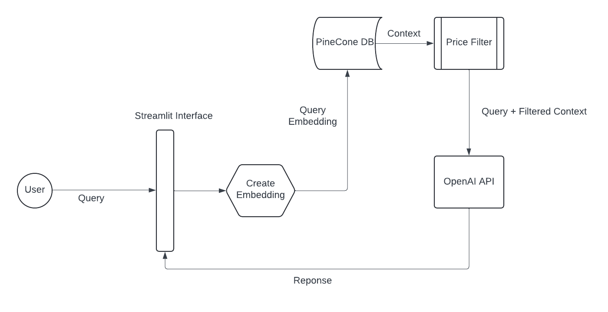
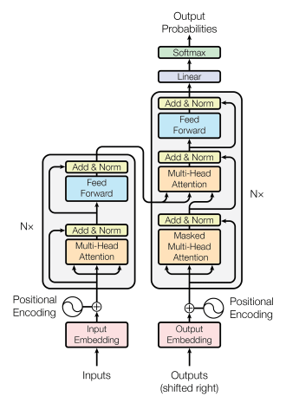

# Amazon Products Agent

## Introduction

The Amazon Products Agent is a chatbot designed to provide tailored product recommendations from Amazon.com by leveraging product metadata from the Amazon Review Dataset. This project focuses on two categories: Amazon Office Products and Appliances.

## Project Architecture

The project utilizes several key technologies and frameworks to achieve efficient storage, retrieval, and processing of product data:

- **Frontend**: Built using the Streamlit framework for an interactive and user-friendly chatbot interface.
- **Backend**: Utilizes Pinecone Vector Database for efficient storage and retrieval of product vectors.
- **Framework**: Employs the Langchain framework to streamline development and integration processes.
- **Embedding Model**: Uses the OpenAI Embedding Model to convert user queries into embedding vectors.
- **Response Generation**: Powered by the OpenAI API (ChatGPT 3.5 Turbo) to generate detailed responses.

## Dataset Description

The Amazon review dataset is a comprehensive collection of reviews and metadata from Amazon.com. It includes product details, user ratings, reviews, and other metadata, providing valuable insights into consumer behavior and preferences. We utilize the product metadata, including title, brand, category, features, description, image_URL, and price, to create vector embeddings stored in the Pinecone Vector Database.

## Data Pre-processing

The data pre-processing steps involve:

- **Handling Missing Data**: Addressing missing data in the title, description, and price sections by removing rows without price and title.
- **Data Chunking**: Creating chunkings of the data for storage in the Pinecone vector DB.
- **Feature Selection**: Selecting relevant features to create and store vector embeddings.
- **Embedding Creation**: Using OpenAI's embedding model to create embeddings of the text data.
- **Vector Upsertion**: Upserting vectors to Pinecone DB in batches for easier insertion.

## Transformers

Transformers are deep learning models introduced in the paper "Attention is All You Need." They use a self-attention mechanism to capture long-range dependencies and contextual information within input sequences, making them well-suited for natural language processing tasks. Positional encodings are incorporated to provide information about the position of tokens within the input sequence.

## RAG (Retrieval Augmented Generation)

The Retrieval Augmented Generation (RAG) process involves:

1. **Retrieval**: Searching a database of texts to find relevant information about the query.
2. **Augmentation**: Selecting the most useful snippets of information.
3. **Generation**: Generating a detailed and accurate answer using these snippets.

## Workflow

1. **User Input**: The user enters a query (e.g., "I want an ink pen").
2. **Embedding Creation**: The OpenAI Embedding Model converts the user's query into an embedding vector.
3. **Query Vector Storage**: The embedding vector is queried against the vectors stored in Pinecone to find the top 5 most relevant product vectors.
4. **Filtering**: The top 5 results are filtered based on price to meet the user's requirements.
5. **Response Generation**: ChatGPT 3.5 Turbo uses the filtered product information to generate a response, helping the user choose their products and answering any queries.
6. **Response**: The response is sent back to the user.

## Technologies Used

- **Response Generation**: OpenAI API (ChatGPT 3.5 Turbo)
- **Query Processing**: OpenAI Embedding Model
- **Framework**: Langchain
- **Vector Storage and Retrieval**: Pinecone Vector DB
- **User Interface**: Streamlit Framework
- **Backend Logic**: Python

## Output

The output includes tailored product recommendations and detailed responses generated by the chatbot based on the user's query and filtered product information.

## Future Work

Future improvements to the Amazon Products Agent may include expanding the product categories, enhancing the chatbot's conversational capabilities, and optimizing the data processing and retrieval mechanisms.
